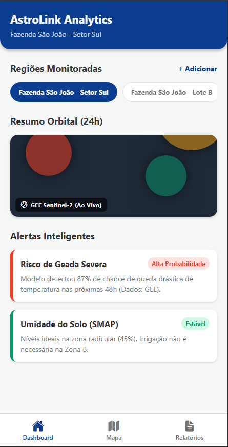
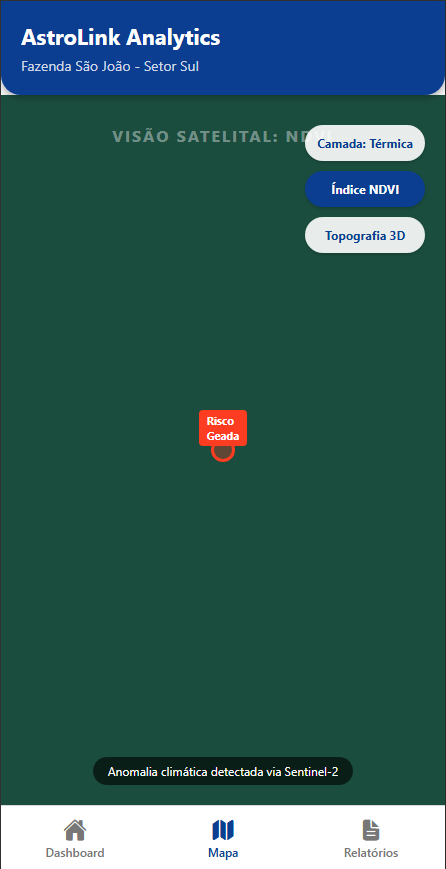
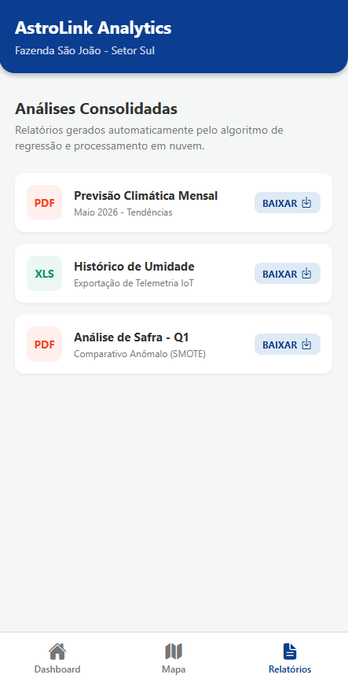
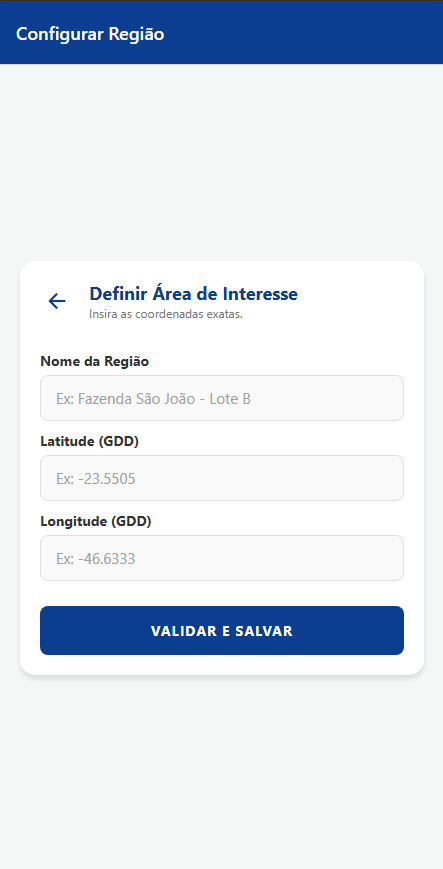

# 🛰️ AstroLink Analytics

> Monitoramento Orbital Inteligente e Soluções Terrestres baseadas em IA e Dados Satelitais.

---

## 📌 Sobre o Projeto & Conexão com o Tema Espacial

O **AstroLink** é uma solução mobile desenvolvida em **React Native + Expo** focada na nova corrida espacial e seu impacto na Terra. Nosso objetivo é democratizar o acesso ao Big Data Orbital, transformando petabytes de imagens de satélite (processadas simuladamente pelo Google Earth Engine) em ações geoprocessadas na palma da mão do produtor ou gestor.

🌍 **Conexão com a Indústria Espacial:** A aplicação atua como o front-end inteligente que canaliza predições de safras, riscos climáticos (geadas) e níveis de umidade do solo a partir de telemetria satelital (Sentinel/Landsat), alinhando-se aos ODS da ONU (2, 9 e 13) para garantir segurança alimentar e inovação resiliente.

---

## 👨‍💻 Equipe

| Nome                                 | RM       |
| ------------------------------------ | -------- |
| Djalma Moreira de Andrade Filho      | RM555530 |
| Felipe Paes de Barros Muller Carioba | RM558447 |
| Lucas Rodrigues de Queiroz           | RM556323 |
| Matheus Gushi Morioka                | RM556935 |
| Victor Hugo de Paula                 | RM554787 |

---

## ⚙️ Funcionalidades Implementadas

### 🗺️ Mapeamento Dinâmico
* Renderização simulada de camadas orbitais (Térmica, NDVI, Topografia 3D).
* Persistência da preferência de visualização do usuário com `AsyncStorage`.

### 🚨 Alertas Inteligentes e Context API
* Gerenciamento de estado global com `Context API` para alternar entre diferentes regiões geográficas monitoradas em tempo real.
* Feedback preditivo de riscos climáticos baseado em modelos de ML (simulado).

### 📝 Formulário Espacial e Validação
* Mapeamento de novas áreas de interesse com validação rigorosa de coordenadas (Latitude/Longitude) utilizando `React Hook Form` e `Yup`.

### ✨ UX e Animações Nativas
* Transições fluidas usando `Animated` e `LayoutAnimation` para aprimorar a experiência de navegação e renderização de dados.

---

## 🚀 Como Executar o Projeto

### Pré-requisitos
* Node.js (v18+ recomendado)
* Expo CLI
* Aplicativo Expo Go (dispositivo móvel)

```bash
# Clone o repositório
git clone https://github.com/dipaula-victo/astrolink-app

# Acesse o diretório
cd astrolink-app

# Instale as dependências
npm install

# Inicie o servidor do Expo
npx expo start
```

* Para testar no celular, abra o **Expo Go** e escaneie o QR Code exibido no terminal ou pressione `w` para abrir a simulação no navegador.

---

## 📱 Capturas de Tela

| Dashboard | Mapa de Calor | Relatórios | Configurar Região |
| :---: | :---: | :---: | :---: |
|  |  |  |  |

---

## 🎥 Vídeo de Demonstração

[Acesse aqui o vídeo demonstrativo do aplicativo no YouTube](https://www.youtube.com/shorts/XVWAcji830M)

---

## 🗂️ Estrutura do Código-Fonte

```text
astrolink-app/
├── app/
│   ├── (tabs)/
│   │   ├── _layout.jsx
│   │   ├── dashboard.jsx
│   │   ├── map.jsx
│   │   └── reports.jsx
│   ├── _layout.jsx
│   └── add-area.jsx
├── src/
│   ├── components/
│   │   ├── AlertCard.jsx
│   │   ├── Header.jsx
│   │   └── MapWidget.jsx
│   ├── constants/
│   │   └── theme.js
│   ├── contexts/
│   │   └── DataContext.jsx
│   └── utils/
│       └── mockData.js
└── README.md
```

## 🛠️ Stack Tecnológica

| Tecnologia | Uso |
| --- | --- |
| **React Native** | Desenvolvimento Mobile |
| **Expo & Expo Router** | Plataforma e Roteamento Baseado em Arquivos |
| **Context API** | Gerenciamento de Estado Global |
| **AsyncStorage** | Persistência Local de Dados |
| **React Hook Form + Yup** | Tratamento e Validação de Formulários |
| **Animated API** | Animações e Transições Nativas |

---
*Global Solution 2026.1 - Mobile Development & IoT | FIAP*
